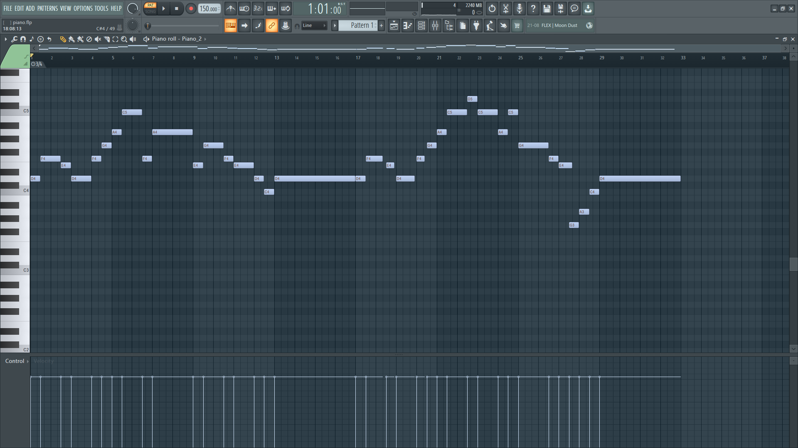
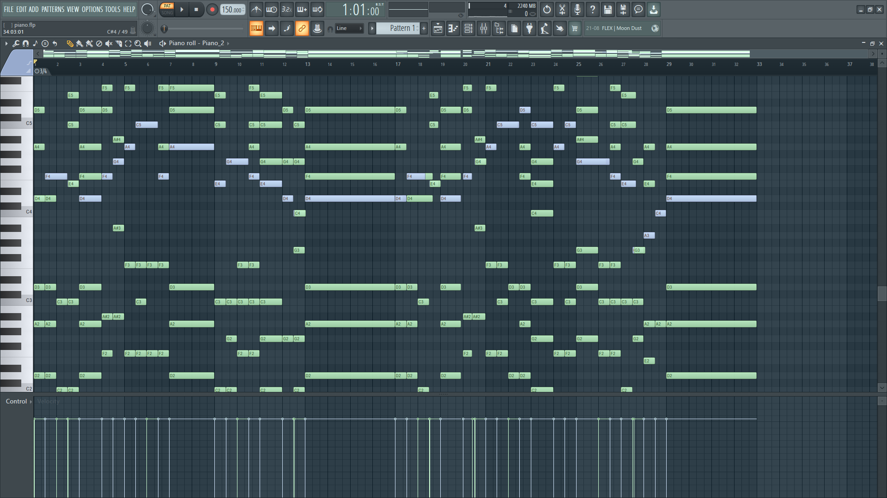

# 🎹 MIDI AI Studio

> AI-powered music composition platform with professional MIDI generation, editing, and style learning capabilities.

## ✨ Features

 **💡 Workflow Revolution:** This AI can accomplish in minutes what would traditionally take a skilled musician 10+ years of piano study and music theory mastery to achieve. If you have strong theoretical knowledge but lack instrumental proficiency, this tool bridges that gap instantly.
 
- **AI Music Generation**: Create professional MIDI compositions from text descriptions
- **Reference Style Learning**: Upload MIDI files to teach AI your preferred musical style
- **MIDI Editing**: Upload and edit existing MIDI files with AI assistance
- **Text ↔ MIDI Conversion**: Bidirectional conversion between text notation and MIDI
- **Professional Output**: Support for 1-200 bars with sophisticated harmony and dynamics
- **Real-time Preview**: View MIDI notation before downloading


## 🎨 Example: Orchestral Harmony Enhancement

### Original MIDI (Before)

*Simple melody line (33 bars)*

### AI-Enhanced Result (After)

*Full orchestral arrangement with 5-part harmony*

**Prompt Used:**
Keep the main melody fully intact and positioned in the high register.
Do not alter or revoice the melody in any way — it remains exactly as written.
Add rich orchestral harmony layers beneath the melody, forming at least
5-part harmony for a full ensemble texture.
Maintain smooth voice leading and overall orchestral balance, ensuring
a deep, lush harmonic texture throughout.
Keep the total structure exactly 33 bars.
Use cinematic or symphonic voicing principles:

High range (D4–A6): Melody remains clear and dominant.
Upper-mid range (G3–G5): Light harmonic or supportive lines.
Middle range (C3–C5): Core harmonic foundation and color tones.
Lower range (C2–C4): Deep harmonic reinforcement and root tones.
Sub-low range (E1–C3): Optional octave or bass grounding.

Keep the harmony openly spaced in lower registers and closer in upper
registers for natural cinematic warmth.
Preserve the melody as the clear focal point, while the underlying
harmony moves slowly, legato, and dynamically supportive, never
rhythmically intrusive.
The final sound should be lush, emotive, and fully cinematic, maintaining
clarity, warmth, and melodic dominance across all 33 bars.

**Result:** The AI successfully added cinematic harmonic layers across 5 voices 
while preserving the original melody's position and character, creating a 
professional orchestral arrangement.

---

## 🚀 Live Demo

🚀 Live Demo

Frontend:  [https://ai-midi-generator.onrender.com/api]
Backend API: [https://ai-midi-generator-six.vercel.app/]


## 🛠️ Tech Stack

### Frontend
- React 18 + Vite
- Tailwind CSS
- Lucide React Icons
- React Router (client-side routing)

### Backend
- Node.js + Express
- Google Gemini AI API
- Custom MIDI Parser & Generator
- In-memory reference storage

## 📋 Prerequisites

- Node.js 18+ and npm
- Google Gemini API Key ([Get one here](https://makersuite.google.com/app/apikey))
- Git

## 🏃 Local Development

### 1. Clone Repository

```bash
git clone https://github.com/bharath-mnr/ai-midi-generator
cd ai-midi-generator
```

### 2. Install Dependencies

```bash
# Install root dependencies
npm install

# Install all workspace dependencies
npm run install:all
```

### 3. Configure Environment Variables

**Backend** (`backend/.env`):
```env
GEMINI_API_KEY=your_google_gemini_api_key_here
PORT=5000
```

**Frontend** (`frontend/.env`):
```env
VITE_API_URL=http://localhost:5000/api
```

### 4. Run Development Servers

```bash
# Run both frontend and backend concurrently
npm run dev
```

- Frontend: http://localhost:5173
- Backend: http://localhost:5000

## 🎵 MIDI Text Notation Format

The application uses a custom text-based MIDI notation:

```
Tempo: 120
TimeSig: 4/4
Key: C

Bar: 1
C4:   X . . .   X60 . . .   . . X80 .   . . . X
E4:   . X . .   . . X . .   X . . .   . X . .
G4:   . . X .   . . . X .   . X . .   . . X .
```

### Symbols
- `X` = Note (velocity 100)
- `X[1-127]` = Note with specific velocity
- `.` = Rest
- `~` = Sustain
- `XR[n]` = Right offset (delayed start)
- `XE[n]` = Early cutoff (shortened duration)

## 🎹 Usage Examples

### Generate Music from Description
```
Compose a 16-bar piano piece in C major with emotional melody, 
rich harmonies, and dynamic crescendos
```

### Edit Existing MIDI
1. Upload MIDI file
2. Describe changes: "Add bass line and make it more dramatic"
3. Download enhanced version

### Use Reference Files
1. Upload 2-3 MIDI files in your preferred style
2. Generate new compositions matching that style
3. AI learns tempo, harmony, and rhythmic patterns

## 🔧 Configuration

### Time Signatures Supported
- 4/4, 3/4, 2/4 (Standard)
- 6/8, 12/8 (Compound)

### Composition Length
- Minimum: 1 bar
- Maximum: 200 bars
- Optimal quality: 16-48 bars

### Performance Modes
- **Fast**: Quick generation (16 bars default)
- **Balanced**: Quality/speed balance (32 bars)
- **Quality**: Best results (48 bars)

## 📊 API Endpoints

### Main Endpoints

```
POST   /api/chat                  # AI music generation
POST   /api/upload-reference      # Add reference file
POST   /api/upload-midi          # Upload MIDI for editing
POST   /api/midi-to-text         # Convert MIDI → Text
POST   /api/text-to-midi         # Convert Text → MIDI
GET    /api/files/:userId        # Get reference library
POST   /api/files/:userId/clear  # Clear references
GET    /api/health               # Health check
```

## 🤝 Contributing

Contributions are welcome! Please follow these steps:

1. Fork the repository
2. Create feature branch: `git checkout -b feature-name`
3. Commit changes: `git commit -m 'Add feature'`
4. Push to branch: `git push origin feature-name`
5. Submit pull request

## 📝 License

This project is licensed under the MIT License - see [LICENSE](LICENSE) file for details.

## Acknowledgments

- Google Gemini AI for music generation
- MIDI file format specification
- Open source community


## 🎯 Roadmap

- [ ] Multi-track MIDI support
- [ ] Real-time audio playback
- [ ] Chord progression suggestions
- [ ] Export to MusicXML
- [ ] Collaborative editing
- [ ] Mobile app version

---
